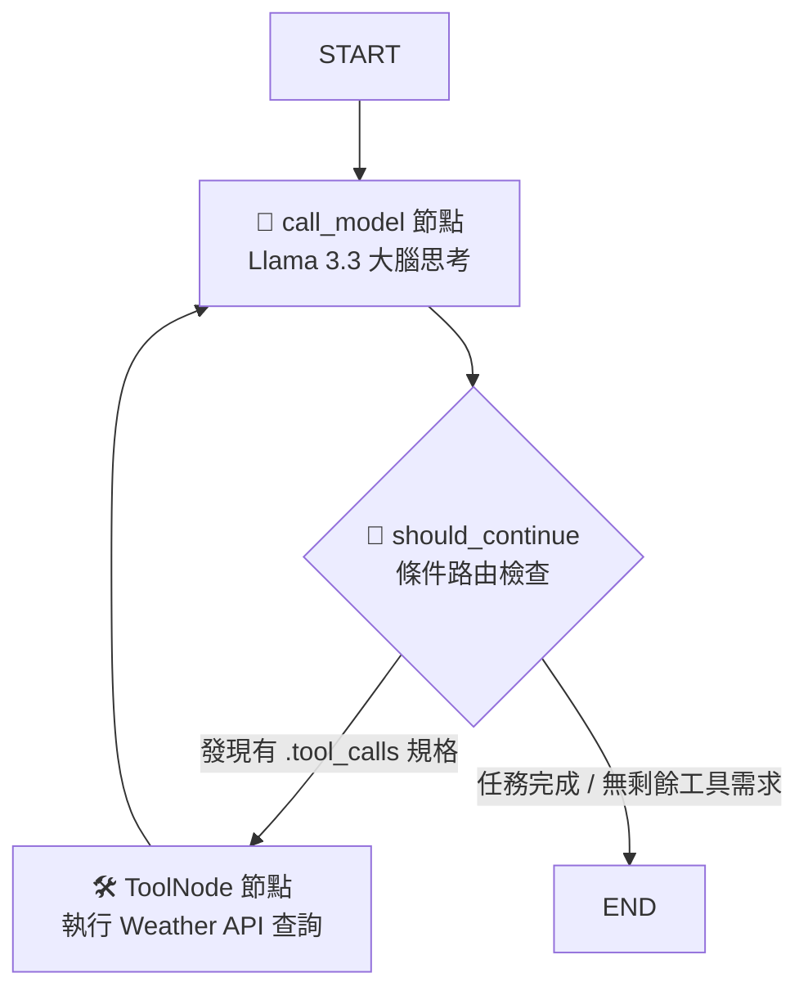
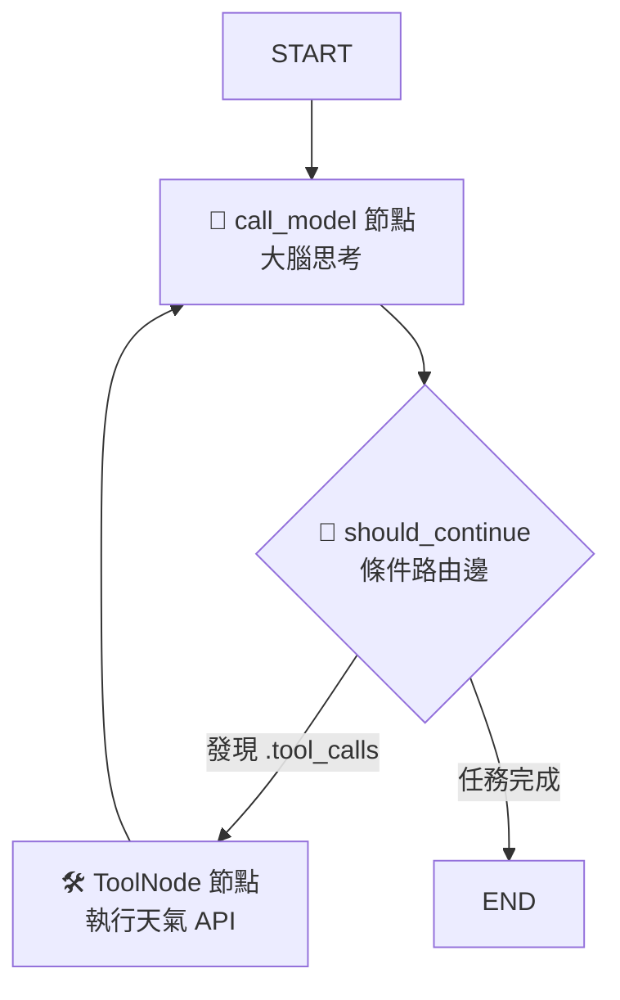

# 🌤️ Architecture Evolution: LangGraph 智慧天氣查詢 Agent

<p align="center">
  
  
  
</p>

本專案經歷了兩代 AI Agent 架構的迭代，旨在探索 LLM 工具調配（Tool Orchestration）的最佳實踐。專案**核心以 LangGraph 狀態機為主角**，將傳統 ReAct (Reason+Act) 的思考模式轉化為顯式的有向循環圖（Directed Graph）結構，以解決線性鏈在面對多輪工具呼叫（Tool Calling）時的狀態流失與失控痛點。

---

## ⚖️ 技術演進：從 LangChain 到 LangGraph

在專案開發初期，我使用傳統的 **LangChain** 實作了基礎 ReAct Agent，隨後為了追求更高的流向可控性與健全度，全面重構升級為 **LangGraph** 狀態圖架構：

| 比較維度 | v1 LangChain 線性鏈版本 (`weather_agent.py`) | v2 LangGraph 狀態圖版本 (`weather_agent_v2.py`) 🚀 |
| :--- | :--- | :--- |
| **程式流向控制** | **線性/黑盒子結構**<br>難以靈活處理工具執行失敗後的動態流轉與二次推理。 | **顯式有向循環圖 (Directed Graph)**<br>透過條件路由邊（Conditional Edges）實現精準的 ReAct 循環流向控制。 |
| **全域狀態記憶** | 依賴外部抽象的 Memory 組件，多次 Tool Calling 後上下文或變數容易聚焦模糊。 | **全局唯一 `AgentState` 傳送帶**<br>各節點獨立且共享狀態規格，資料流向透明且完全可預測。 |
| **架構擴充性** | 較低。若未來想擴充多個不同領域的 Tool，Agent 邏輯容易混亂。 | **極高**。將大腦思考與外部 API 拆解為獨立 Node，可無限擴充子圖。 |

---

## 🛠️ 開發環境與技術棧 (Tech Stack)

| 分類 | 技術組件 / 框架 | 專案內用途描述 |
| :--- | :--- | :--- |
| **Agent 核心** |  | 建構 `StateGraph`、定義邊與節點，掌控 Agent 核心生命週期 |
| **基礎對比** |  | 作為第一代線性鏈 baseline，用以對比架構優劣 |
| **LLM 推理** |  | 負責全局意圖解析、參數提煉與繁中報告整理 |
| **外部整合** |  | 遵循 Model Context Protocol 概念實作背景自動化工具串接 |
| **天氣 API** |  | 提供即時與預報天氣數據查詢接口 |
| **開發語言** |  | 採用 `venv` 進行虛擬環境隔離與套件管理 |

---

## 📊 v2 LangGraph 核心系統架構圖

本專案的核心靈魂在於顯式的圖結構設計，透過 `should_continue` 路由控制「思考」與「行動」的循環：


---

## 🚀 核心特色
- **狀態驅動架構 (State-Driven)**：利用全局唯一的 `AgentState` 傳送帶，即時同步對話上下文，避免跨節點資料遺失。
- **動態循環路由 (Conditional Edges)**：自主檢查 LLM 訊息物件自帶的 `.tool_calls` 屬性，在「大腦思考」與「外部工具執行」之間彈性流轉，直到任務完成。
- **金鑰安全防護**：全面導入 `.env` 環境變數機制，並嚴格透過 `.gitignore` 阻擋私密金鑰上傳，符合企業級安全開發規範。

## 📊 系統架構流程圖


---
## 📦 快速開始 (Quick Start)

想要在本地端測試這個專案，請照著以下步驟操作：

### 1. 複製專案到本地
打開您的終端機，執行以下指令將程式碼下載下來：
```bash
git clone [https://github.com/ching0296/weather_searching_agent.git](https://github.com/ching0296/weather_searching_agent.git)
cd weather_searching_agent
```

### 2. 安裝依賴環境
請確保已啟動您的虛擬環境 `(myenv)`，並執行：
```bash
pip install -r requirements.txt
```

### 3. 設定環境變數
在專案根目錄下建立一個 `.env` 檔案，並填入您的私密 API 金鑰：
```bash
GROQ_API_KEY="your_groq_api_key_here"
WEATHER_API_KEY="your_weather_api_key_here"
```

### 4. 執行本地互動測試
* 執行 LangGraph 版本
    ```bash
    python weather_agent_v2.py
    ```
* 執行 LangChain 版本
   ```bash
    python weather_agent.py
    ```
  